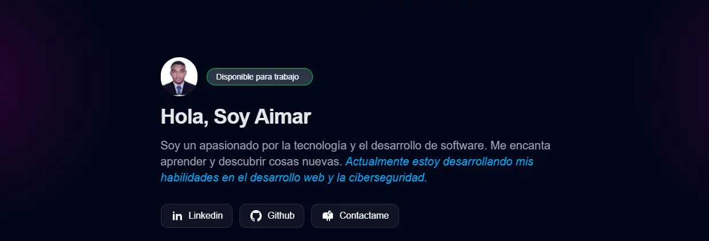

# Mi portafolios Web

## Este es un proyecto indivudual de la creciond e mi portfolio Web.

Este es un proyecto en solitario de mi, experimentando con el framework de Astro en la creacion de un portfolio,
Un agradecimiento especial a @Midudev por sus cursos en especial al de astro

